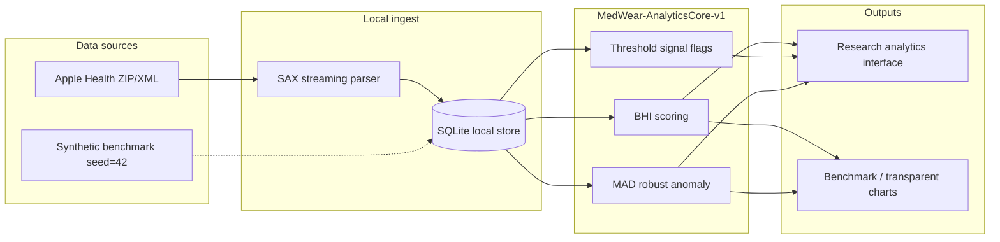

# MedWear · Local-First Wearable Digital Phenotyping and Health Analytics Framework

[](https://github.com/zhengjiewu39-lab/MedWear-Health-Analytics/actions/workflows/ci.yml)

> **Documentation (main):** English and Chinese methods docs are **auto-generated from the same source** (`server/config/methodologyTransparency.js`). Core analytics = **BHI** + **robust MAD heuristic** + **`MedWear-RuleEngine-v1`** (not legacy 2σ / discrete health score). Sync: `npm run docs:sync` · verify: `npm run docs:verify`.

A full-stack **wearable digital phenotyping research framework** — Apple Health local-first import, transparent statistical analysis, reproducible synthetic benchmarks, and exploratory outcome simulation (outside primary manuscript scope).

**Positioning:** **Research software framework** for **wearable digital phenotyping** — transparent-by-design analytics, **local-first primary data-processing path**, and a **reproducible computational benchmark**. **Not a clinical diagnostic system**; **not validated disease screening**; **not a calibrated disease-risk model**; **not prospective clinical validation**.

Connects consumer wearables to **interpretable wearable-derived research outputs** via **local-first data handling designed to reduce unnecessary external transfer of complete raw health records** and **transparent-by-design analytics**.

## Primary pipeline (manuscript scope)

```
Apple Health / synthetic input
  → local-first ingestion
  → structured local storage (SQLite)
  → daily wearable digital phenotypes
  → BHI + threshold signal flags + robust MAD anomalies
  → BHI watch tier
  → reproducible benchmark metrics (n=5000, seed=42)
```

Real and synthetic inputs are **separated at ingestion** and enter the **shared analytics pipeline after structured data formation**. Exploratory modules (research signal integration, cohort simulation, clinician-style reports, ONNX) are **outside the primary manuscript scope** — see [docs/METHODS.md](docs/METHODS.md).

**One-click manuscript reproduction:** [`notebooks/paper_reproduction.ipynb`](notebooks/paper_reproduction.ipynb) — **primary path:** synthetic benchmark (seed=42) → BHI → threshold signal flags → MAD → BHI watch tier → evaluation metrics. **Optional appendix:** ONNX / transparent component charts. See [`notebooks/README.md`](notebooks/README.md).

**Manuscript follows system (do not reverse-edit code for Word):** run `npm run docs:manuscript-sync` → copy from [`docs/ARTICLE-FOLLOW-SYSTEM.md`](docs/ARTICLE-FOLLOW-SYSTEM.md). Freeze tag: `medwear-manuscript-v1.2.2`.

---

## System architecture

Data flows locally from ingestion through analytics to transparent outputs. **Synthetic evaluation** and **real-data** input paths are **separated before shared analytics**; real-data mode uses a **local-first primary processing path** for Apple Health exports.



**One-command Docker run:**

```bash
docker build -t medwear-api . && docker run --rm -p 3001:3001 \
  -e ALLOW_DEMO_AUTH=true \
  -v "$(pwd)/data:/app/data" \
  medwear-api
# Open http://localhost:3001 · or: docker compose up --build
```

**System benchmarks (optional engineering figures):** `npm run benchmark:system` → latency/throughput curves (not primary manuscript endpoints).

---

## Highlights

| Capability | Description |
|------------|-------------|
| **Dual-mode architecture** | Synthetic evaluation vs real-data (Apple Health) — input paths separated before shared analytics |
| **Apple Health pipeline** | SAX streaming parser → SQLite local store → transparent analytics |
| **Primary manuscript analytics** | BHI, fixed threshold signal flags, individualized robust MAD anomaly, BHI watch tiers |
| **Reproducible benchmark** | MedWear-Wearable-Analytics-Benchmark-v3 (n=5000, seed=42) with independent synthetic reference labels |
| **Exploratory modules (outside primary manuscript scope)** | Parameter-driven cohort/outcome simulation; research signal integration UI — not primary benchmark endpoints |
| **Analytics Lab** | In-app benchmark charts, methods transparency, evaluation metrics |
| **Engineering quality** | Unit tests, CI, Docker, audit log, encrypted vault |

---

## Tech Stack

- **Frontend:** React 18, MUI 5, Recharts, React Router 6
- **Backend:** Express 5, SAX XML parser, SQLite persistence (`better-sqlite3`)
- **AI:** Rule engine (`MedWear-RuleEngine-v1`) + optional LLM (real mode) — not a trained ML ensemble; ONNX disabled by default
- **Security:** JWT auth, audit log, AES-256-GCM health vault

---

## Quick Start

### 开发（改代码）

```bash
npm install
npm run dev          # API :3001 + 前端 :3000
```

### 桌面安装包（无需 Node.js，双击即用）

在项目目录打包（仅需一次）：

```bash
npm install
npm run desktop:mac    # 生成 release/MedWear-0.1.0-mac.dmg
```

将 **`release/MedWear-0.1.0-mac.dmg`** 发给他人：双击安装 → 从「应用程序」打开 **MedWear Health Analytics**。  
Windows 打包：`npm run desktop:win` → `release/MedWear-0.1.0-Setup.exe`。

### 单机软件（需 Node.js，浏览器打开）

**必须先进入项目文件夹**（不能在系统根目录 `/` 运行）：

```bash
cd ~/Desktop/医用可穿戴设备数据分析平台
npm install          # 只需第一次
npm run app          # 自动打开 http://localhost:3001
```

macOS 也可 **双击** 项目根目录下的 `启动 MedWear.command`。

账号：`admin` / `admin123` · `demo` / `demo123`

> **⚠ Security — local demo only:** Default accounts and sample secrets in `.env.example` are for local research prototyping. **Production deployments must** set `MEDWEAR_JWT_SECRET`, `MEDWEAR_ENCRYPTION_KEY`, strong passwords, `NODE_ENV=production`, and `ALLOW_DEMO_AUTH=false`. See [docs/ETHICS.md](docs/ETHICS.md).

**常见错误：**

| 报错 | 原因 | 解决 |
|------|------|------|
| `ENOENT ... /package.json` | 在错误目录（如 `/`）运行 | 先 `cd` 到项目文件夹 |
| `Tracker "idealTree" already exists` | 在 `npm run app` 里嵌套运行了 npm | 先单独执行 `npm install`，再 `npm run app`；或 `npm cache clean --force` |

详细打包与 Docker 分发见 **[docs/DESKTOP.md](docs/DESKTOP.md)**。

| 模式 | 命令 | 访问地址 |
|------|------|----------|
| 开发 | `npm run dev` | http://localhost:3000 |
| **桌面安装包** | **`npm run desktop:mac`** | 双击 `.app` / `.dmg` |
| **单机应用** | **`npm run app`** | **http://localhost:3001** |
| Docker | `docker compose up --build` | http://localhost:3001 |

**Accounts:** `demo/demo123` · `admin/admin123`

> **Demo vs production:** Demo accounts work when `NODE_ENV !== 'production'` or `ALLOW_DEMO_AUTH=true`. In production, set `MEDWEAR_JWT_SECRET`, `MEDWEAR_ENCRYPTION_KEY`, and `CORS_ORIGIN`. See `.env.example`.

---

## Apple Health Import (Real-Data Mode)

1. iPhone **Health** App → Export All Health Data → `apple_health_export.zip`
2. Switch to **真实模式** → **数据导入**
3. Upload zip or drop into `health-import/` and scan

Supported: HeartRate, OxygenSaturation, StepCount, SleepAnalysis, HRV (SDNN), ActiveEnergyBurned, RespiratoryRate.

> Apple Health records are processed on a **local-first primary processing path** and persisted in **SQLite** (`data/medwear-health.db`). Encrypted vault snapshots are used for backup where enabled. Legacy `data/health-store.json` is migrated once on import only.

---

## Evaluation & Reproducibility

**Anti–self-test policy:** wearable benchmark labels come from `independentSyntheticReference-v1` (independent synthetic reference labels via rule-based reference labeling). Metrics measure **engine-versus-reference agreement** — not circular 100% self-scores.

**Primary benchmark endpoints:** threshold signal outputs, MAD anomaly outputs, BHI, BHI watch tier. Domain-weighted RuleEngine outputs are **not** direct primary benchmark endpoints.

```bash
npm run generate:benchmark   # random physiology + independent synthetic reference labels (n=5000)
npm run test:server
npm run evaluate             # → benchmarks/results/latest.json (gitignored; see benchmarks/results/example-summary.json)
npm run evaluate:supplement    # scenarios + FP burden + fair/oracle ML compare + EVALUATION sync
```

> **Note:** Full benchmark JSON artifacts under `benchmarks/results/*.json` are **gitignored** (except `example-summary.json`). Regenerate locally with `npm run evaluate`.

| Metric (n=5000, seed=42, BHI + MAD engine) | Value | 95% CI |
|--------------|-------|--------|
| Alert F1 | 0.854 | — |
| Alert precision | 0.772 | — |
| Alert recall | 0.956 | — |
| Anomaly accuracy | 0.694 | 0.681–0.707 |
| BHI watch-tier agreement | 0.760 | 0.748–0.772 |
| BHI score agreement (±8 pts) | 0.701 | 0.688–0.713 |

### Documentation

| Doc | Topic |
|-----|-------|
| [docs/METHODS.md](docs/METHODS.md) | BHI + MAD + alerts (auto-synced via `npm run docs:sync`) |
| [docs/EVALUATION.md](docs/EVALUATION.md) | Benchmark protocol |
| [docs/ETHICS.md](docs/ETHICS.md) | Privacy & limitations |
| [docs/REPRODUCIBILITY.md](docs/REPRODUCIBILITY.md) | Docker, CI |
| [CHANGELOG.md](CHANGELOG.md) | Version history |
| [docs/EXTERNAL-VALIDATION.md](docs/EXTERNAL-VALIDATION.md) | Public dataset validation plan |

**Single source of truth:** `GET /api/methodology/transparency` · in-app Methodology page · `docs/METHODS*.md` (regenerate with `npm run docs:sync`).

---

## Main Modules

| Route | Module |
|-------|--------|
| `/dashboard` | Health overview |
| `/import` | Apple Health import |
| `/research` | Analytics evaluation center |
| `/screening` | Exploratory research signal integration (outside primary manuscript scope) |
| `/doctor-report` | Structured research report |
| `/monitoring` | Real-time vitals |
| `/ai/anomaly` | Anomaly detection |
| `/ai/predictive` | Predictive analytics |
| `/methodology` | Methods documentation |

---

## Disclaimer

For demonstration, education, and **research-grade digital phenotyping / reproducible computational evaluation** — **not a medical device**, **not clinical diagnosis**, **not validated disease screening**, and **not clinical risk prediction**. Exploratory modules require professional review. Automated tests and benchmarks use **synthetic data only** (`seed=42`); never commit real Apple Health exports or PHI to this repository.

---

## License

MIT — see [LICENSE](LICENSE).

## Security & contributing

- [SECURITY.md](SECURITY.md) — vulnerability reporting
